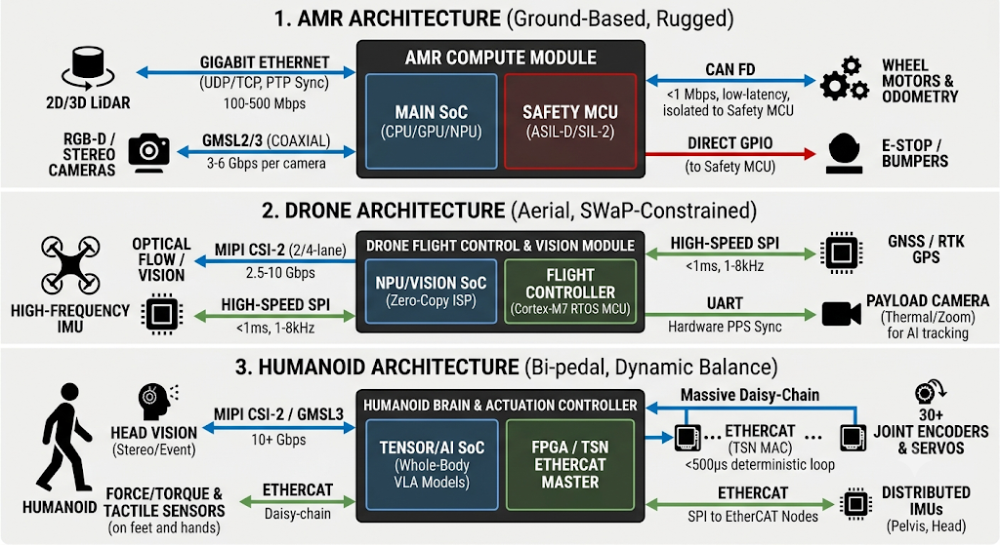
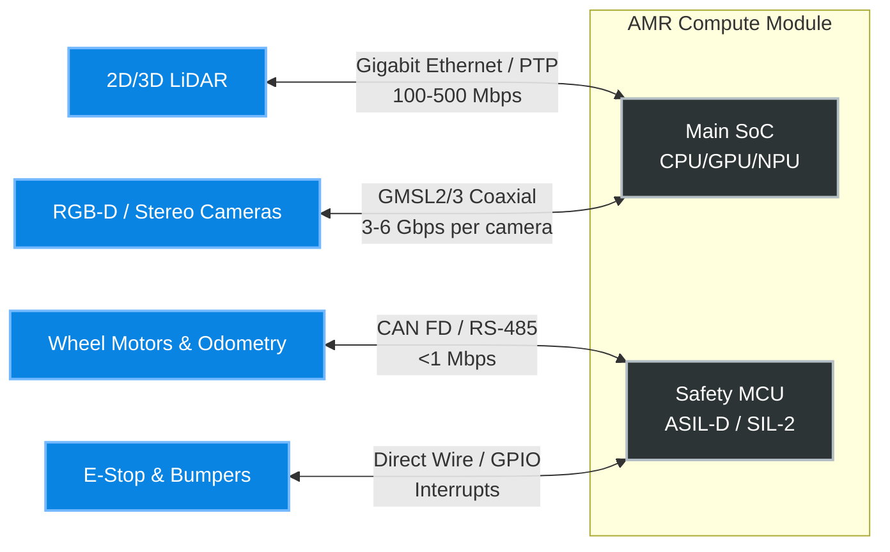
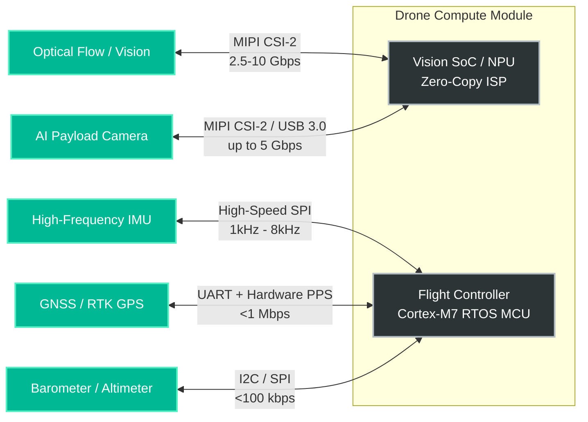
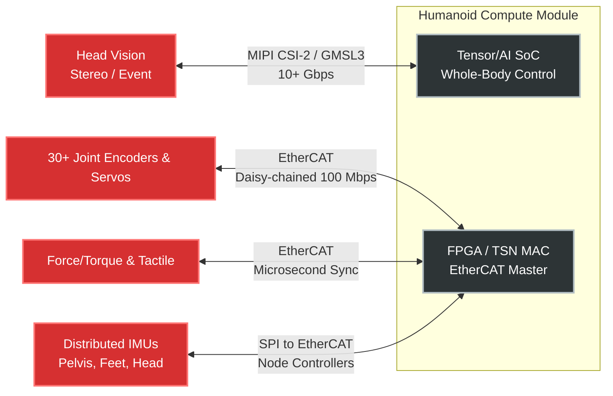

# Taiwan ODMs for Compute Modules

Taiwan is the global epicenter for Industrial PCs (IPCs) and ruggedized edge AI computing. Several major Taiwanese ODMs (Original Design Manufacturers) and OEMs (Original Equipment Manufacturers) build purpose-built Autonomous Mobile Robot (AMR) compute modules and controllers that compete directly with—and often power—systems like Seer Robotics' SRC series.

Like Seer, these companies design fanless, rugged edge controllers equipped with robotics-specific I/O (CAN bus for motor control, GMSL/MIPI-CSI for automotive-grade cameras), and deep hardware-level integration with ROS/ROS2 (Robot Operating System).

Here are the leading Taiwanese manufacturers in the AMR controller space:

### 1. Advantech

Advantech is the largest IPC manufacturer globally and operates a dedicated "AFE-AMR & Robot Solutions" division.

* **Key AMR Products:** The **AFE-R** and **ASR** series (e.g., AFE-R770, AFE-R360).
* **Focus:** They offer ready-to-deploy AMR controllers that combine x86 or ARM computing (Intel Core Ultra, NVIDIA Jetson, Qualcomm) with hardware-level synchronization for sensors. Advantech also layers on a proprietary "Robotic Suite" to help with fleet management, OOB (out-of-band) manageability, and ROS2 integration.

### 2. ADLINK Technology

ADLINK is heavily involved in the open-source robotics community and serves as a primary hardware partner for both Intel and NVIDIA in the robotics sector.

* **Key AMR Products:** The **ROScube** series (ROScube-X with NVIDIA Jetson, ROScube-I with Intel), and the newer **RQX/RQP** edge AI controllers.
* **Focus:** Their controllers are engineered specifically around ROS 2. They feature lockable rugged M12 connectors, lock-step sensor synchronization, and heavy AI acceleration for sensor fusion (processing LiDAR, ultrasonic, and vision simultaneously in real-time).

### 3. Axiomtek

Axiomtek leans into full hardware-software integration for integrators who do not want to build an AMR from scratch.

* **Key AMR Products:** The **ROBOX** series controllers (like the ROBOX500) and the **AMR Builder Package**.
* **Focus:** The ROBOX500 is a dedicated heavy-duty AMR controller featuring a 4-channel GMSL interface (Gigabit Multimedia Serial Link, used for high-bandwidth, long-distance camera feeds). Axiomtek bundles this hardware with their "DigiHub for AMR," providing pre-configured ROS 2 nodes for SLAM (Simultaneous Localization and Mapping) and obstacle avoidance.

### 4. NexCOBOT (A NEXCOM Company)

NEXCOM spun off NexCOBOT to focus entirely on intelligent robotics, motion control, and functional safety.

* **Key AMR Products:** The **RCB** series (like the RCB600 AMR Motherboard) and **GRC** robot controllers.
* **Focus:** NexCOBOT bridges high-level AI perception with low-level industrial control. They are notable for providing x86 functional safety-certified platforms and utilizing EtherCAT (a real-time industrial Ethernet protocol) for microsecond-level command response to the robot's motors.

### 5. Neousys Technology

Neousys is renowned for thermal engineering and extreme ruggedization, making them a go-to for heavy-duty outdoor AMRs, agricultural robots, and autonomous mining vehicles.

* **Key AMR Products:** The **Nuvis** machine vision controllers and **VTC** in-vehicle/telematics controllers.
* **Focus:** While slightly more generalized than a pure "AMR-only" box, their systems feature patented damping brackets for intense vibration resistance, supercapacitor-based UPS (Uninterruptible Power Supply) to prevent data loss during power drops, and specialized frame grabber cards for multi-camera AI inspection.

### 6. Vecow

Vecow focuses on compact, high-performance edge AI, frequently partnering directly with sensor makers like Leopard Imaging and cloud-robotics platforms like Cogniteam.

* **Key AMR Products:** The **EAC** series (powered by NVIDIA Jetson Orin) and the **VTK AMR Dev Kit**.
* **Focus:** They provide "turnkey" AIoT control computers. Their VTK Dev Kit packages their SPC/NAC controllers with integrated 3D LiDAR, stereo cameras, and native ROS 2 autonomy to drastically shorten the prototyping phase for AMR developers.

---

**How they compare to Seer Robotics:**
While Seer Robotics (SRC series) provides highly specialized, closed-ecosystem core controllers bundled closely with their proprietary SLAM software, these Taiwanese ODMs generally provide **open-architecture hardware**. Their systems are designed to run open-source stacks (like ROS2/Nav2) or allow third-party ISVs (Independent Software Vendors) to deploy their own proprietary algorithms on top of highly reliable, industrial-grade compute.

## Sensor Requirements 

To design a compute module capable of powering Autonomous Mobile Robots (AMRs), Drones, or Humanoids, the architecture must balance bandwidth, latency, and power constraints. While all three form factors rely on a central "brain" to run AI and perception workloads, their distinct operating environments drastically change how sensors physically interface with the compute module.

Here are the functional specifications for the sensor interfaces and compute offload requirements across these three form factors.

---

## 1. Autonomous Mobile Robots (AMRs)

**Context:** AMRs operate on the ground, carry heavy payloads, and navigate 2D or 2.5D spaces (warehouses, factories). They are less sensitive to weight but highly sensitive to functional safety (ISO 13849 / SIL-2). Because sensors are distributed across a large chassis, they require interfaces capable of long cable runs without signal degradation.

| Sensor Type | Interface Standard | Bandwidth / Rate | Compute Module Requirement |
| --- | --- | --- | --- |
| **2D/3D LiDAR** | Gigabit Ethernet (UDP/TCP) | 100 - 500 Mbps | CPU/GPU for point-cloud filtering (PCL). Requires IEEE 1588 PTP for SLAM time-sync. |
| **RGB-D / Stereo Vision** | GMSL2/3 or GigE Vision | 3 - 6 Gbps per camera | Hardware ISP processing. GMSL serializers handle long cable runs across the chassis. |
| **Wheel Odometry** | CAN FD or RS-485 | < 1 Mbps | Isolated real-time MCU (e.g., Cortex-R) to guarantee <5ms deterministic safety loops. |
| **Ultrasonic / Bumpers** | CAN FD or direct GPIO | < 1 Mbps | Hardware interrupts routed to a safety-certified microcontroller, independent of the main OS. |
| **IMU** | I2C or SPI | Polling at ~200 Hz | Hardware Pulse-Per-Second (PPS) trigger to synchronize inertial data with camera frames. |

---

## 2. Unmanned Aerial Vehicles (Drones / eVTOLs)

**Context:** Drones operate in 3D space with extreme Size, Weight, and Power (SWaP) constraints. Heavy cabling (like GMSL or Ethernet) is often abandoned in favor of direct board-to-board connections. Latency is critical for flight stability.

| Sensor Type | Interface Standard | Bandwidth / Rate | Compute Module Requirement |
| --- | --- | --- | --- |
| **Optical Flow / Vision** | MIPI CSI-2 (2 or 4-lane) | 2.5 - 10 Gbps | Direct-to-ISP (zero-copy) for lowest latency and weight. HW ISP must handle rapid glare changes. |
| **High-Frequency IMU** | High-speed SPI | 1 kHz - 8 kHz polling | <1ms latency. Typically offloaded to a dedicated RTOS flight controller (Cortex-M7/R5). |
| **GNSS / RTK GPS** | UART or I2C | 115 kbps - 1 Mbps | Hardware PPS pin linked directly to the camera trigger for precise geo-tagging of frames. |
| **Barometer / Altimeter** | I2C or SPI | < 100 kbps | Low-compute footprint; used by the flight controller for altitude state estimation. |
| **Payload (Thermal/Zoom)** | USB 3.0 or MIPI CSI-2 | Up to 5 Gbps | High-TOPS NPU for real-time target tracking, classification, and gimbal lock. |

---

## 3. Humanoid Robots

**Context:** Humanoids represent the most complex edge computing challenge. They feature high Degrees of Freedom (30-50+ joints), requiring dense sensor fusion, whole-body control, and ultra-low latency coordination to maintain balance.

| Sensor Type | Interface Standard | Bandwidth / Rate | Compute Module Requirement |
| --- | --- | --- | --- |
| **Joint Encoders** | EtherCAT or CAN FD | 100 Mbps (EtherCAT) | <500μs deterministic loop time. Requires dedicated FPGA or Time-Sensitive Networking (TSN) MAC. |
| **Force/Torque & Tactile** | I2C/SPI over EtherCAT | 10 - 50 Mbps total | Microsecond-level synchronization with vision to enable rapid impedance/balance control. |
| **Head Vision (Stereo/Event)** | MIPI CSI-2 or GMSL3 | 10+ Gbps | Massive NPU/Tensor acceleration to run Visual-Language-Action (VLA) models and depth mapping. |
| **Multi-node IMUs** | SPI (local) to EtherCAT | < 10 Mbps | Distributed Kalman filtering. Requires time-sync across the pelvis, head, and feet nodes. |

---

## Sensor Architectures

The physical compute module needs different interfaces depending on the robot form factor and its mission requirements. We can compare the three common platforms: 

Here are the functional specifications for the sensor interfaces, mapped out using architecture diagrams to clearly illustrate the physical connections and compute requirements for each robotic form factor.

### 1. Autonomous Mobile Robots (AMRs)

AMRs operate on the ground and navigate 2D or 2.5D spaces. Because sensors are distributed across a large chassis, they require robust interfaces capable of long cable runs without signal degradation. There is also a strict physical separation between high-level autonomy and low-level functional safety.

* **Compute Focus:** High-bandwidth point-cloud filtering and hardware ISP for vision.
* **Safety Focus:** Isolated real-time microcontrollers to guarantee <5ms deterministic safety loops for emergency stops and motor control.

---

### 2. Drones and eVTOLs

Drones operate in 3D space with extreme Size, Weight, and Power (SWaP) constraints. Heavy cabling is often abandoned in favor of direct board-to-board connections (like MIPI). Latency is the most critical factor for flight stability.

* **Compute Focus:** Direct-to-ISP (zero-copy) visual processing to minimize latency.
* **Control Focus:** An RTOS flight controller pulling IMU data via SPI at thousands of times per second to run PID stabilization loops.

---

### 3. Humanoid Robots

Humanoids represent the most complex edge computing challenge. They require dense sensor fusion, Visual-Language-Action (VLA) AI models, and ultra-low latency coordination across 30 to 50+ joints to maintain dynamic balance.

* **Compute Focus:** Massive Tensor/NPU acceleration for spatial awareness and path planning.
* **Networking Focus:** Industrial Ethernet (EtherCAT) driven by an FPGA to ensure data packets reach every limb and joint with sub-500-microsecond deterministic timing.

> **Key takeaway for hardware design:** The primary differentiator between these modules is the **physical layer (PHY) and networking**. A drone compute module thrives on MIPI CSI-2 to save weight; an AMR requires ruggedized GMSL and Gigabit Ethernet for distributed sensors; and a humanoid requires an EtherCAT master controller or FPGA to handle the deterministic microsecond timing required for 40+ servo motors.