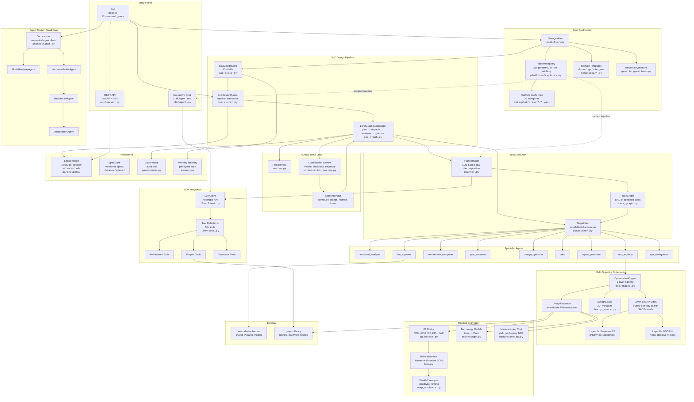
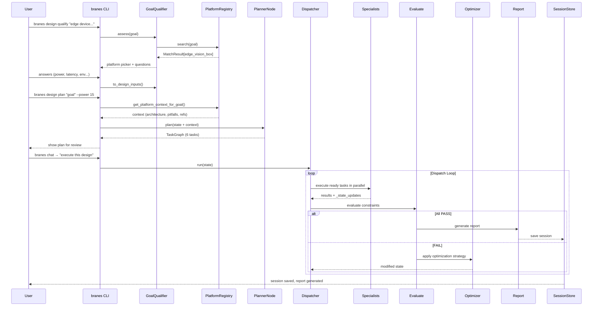

# Embodied AI Architect — System Architecture

## High-Level Architecture

## Data Flow: Design Session Lifecycle

## Component Inventory

### By Layer

| Layer | Components | Files |
|-------|-----------|-------|
| **Entry** | CLI (22 commands), REST API, Chat Agent | `cli/`, `api/server.py`, `llm/agent.py` |
| **Qualification** | GoalQualifier, PlatformRegistry, Templates | `qualification/`, `platforms/` |
| **Orchestration** | SoCDesignRunner, LangGraph, Dispatcher | `graphs/soc_runner.py`, `soc_graph.py`, `dispatcher.py` |
| **Planning** | PlannerNode, TaskGraph | `graphs/planner.py`, `task_graph.py` |
| **Specialists** | 14+ specialist agents | `graphs/specialists.py`, `moo/specialist.py` |
| **MOO Engine** | MAP-Elites → BO/NSGA-III pipeline | `graphs/moo/` (8 files) |
| **Physical** | IP blocks, technology, manufacturing, BOM | `graphs/ip_blocks.py`, `technology.py`, etc. |
| **Human Loop** | Plan review, optimization steering | `graphs/review.py`, `optimization_review.py` |
| **LLM** | Claude API client, 50+ tool definitions | `llm/` (10 files) |
| **Agents** | Orchestrator, Model/HW/Benchmark/Deploy | `agents/`, `orchestrator.py` |
| **Persistence** | Sessions, specs, working memory, governance | `graphs/session_store.py`, `specs/` |
| **Data** | 266 platform YAMLs, taxonomy, schema | `data/platforms/` |

### Key Metrics

| Metric | Value |
|--------|-------|
| Python source files | ~80 |
| CLI command groups | 22 |
| Platform definitions | 266 |
| Platform categories | 36 |
| LLM tools | 50+ |
| Specialist agents | 14+ |
| MOO optimization layers | 3 |
| API endpoints | 15+ |
| Total lines of Python | ~25,000 |
